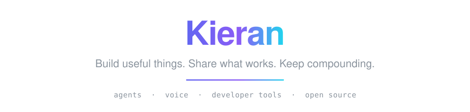

**[kieran.build](https://kieran.build)** · [𝕏 @ninthbit_ai](https://twitter.com/ninthbit_ai) · [oldmeatovo@gmail.com](mailto:oldmeatovo@gmail.com)

Full-stack AI indie hacker · former developer-tools engineer at Big Tech.

I build at the intersection of AI and developer tooling — agents, automation, voice, and open source. Full-time indie since June 2026.

## Featured Projects

| Project | Description |
| --- | --- |
| [**awesome-pi**](https://github.com/BubblePtr/awesome-pi)  | Curated list of Pi Coding Agent extensions, themes, skills, and community resources |
| [**PiGUI**](https://github.com/BubblePtr/PiGUI) | The missing GUI for the Pi coding agent — session replay, traces, cost truth. Electron + React |
| [**Voily**](https://github.com/BubblePtr/Voily) | Native macOS voice dictation app with local MLX-powered ASR |
| [**AgentHuntify**](https://github.com/BubblePtr/AgentHuntify) | AI Agent technology directory — Bun, TanStack Start, Cloudflare Workers |
| [**LawTriage**](https://github.com/BubblePtr/LawTriage) | AI-powered outbound triage demo for law firms — real-time voice agent with OpenAI ASR/LLM/TTS |
| [**concerto**](https://github.com/BubblePtr/concerto) | Open-source Rust port of OpenAI's Symphony |
| [**gtrboard**](https://github.com/BubblePtr/gtrboard) | AI-native content curation workbench — discover & evaluate GitHub Trending projects with LLMs |
| [**MindBack**](https://github.com/BubblePtr/MindBack) | Open-source attention tracker — Rust + Tauri |
| [**VibeBar**](https://github.com/BubblePtr/VibeBar) | Native macOS menu bar app to track AI coding tool usage |

## Upstream Contributions

Bug reports and proposals landed in projects I use:

- [**facebook/astryx**](https://github.com/facebook/astryx) — three confirmed UI bugs with minimal reproductions ([#4830](https://github.com/facebook/astryx/issues/4830), [#4833](https://github.com/facebook/astryx/issues/4833), [#4834](https://github.com/facebook/astryx/issues/4834)), all fixed upstream within days
- [**AlDanial/cloc**](https://github.com/AlDanial/cloc) — proposed Cangjie language support ([#895](https://github.com/AlDanial/cloc/issues/895)), now shipped
- Bug reports in [tw93/Mole](https://github.com/tw93/Mole/issues/1108), [doocs/md](https://github.com/doocs/md/issues/1144), and [666ghj/BettaFish](https://github.com/666ghj/BettaFish/issues/244)

## Current Focus

- 🚀 Shipping AI-native products and tools, full-time
- 🎬 Daily short-form videos recommending open source projects on X
- ✍️ Writing about AI engineering, indie dev, and systems thinking at [kieran.build](https://kieran.build)
- 🧪 Experimenting with multi-agent collaboration, voice agents, and LLM observability

## Tech Stack

<!-- TECH_STACK_START -->
_GitHub Linguist bytes from active repositories · refreshed 2026-08-12._

| Language | Share | Key Repos |
| --- | ---: | --- |
| TypeScript | 60.7% | PiGUI, AgentHuntify, LawTriage, gtrboard |
| Swift | 21.3% | Voily, VibeBar |
| Rust | 7.1% | concerto, MindBack |
| CSS | 4.4% | AgentHuntify, Voily, PiGUI, ZenBlog |
| Python | 1.3% | gtrboard, MindBack, Voily |
| MDX | 1.3% | ZenBlog |
| Astro | 1.3% | ZenBlog |
<!-- TECH_STACK_END -->

Refreshed by `scripts/update_tech_stack.sh`.

Build useful things. Share what works. Keep compounding.

